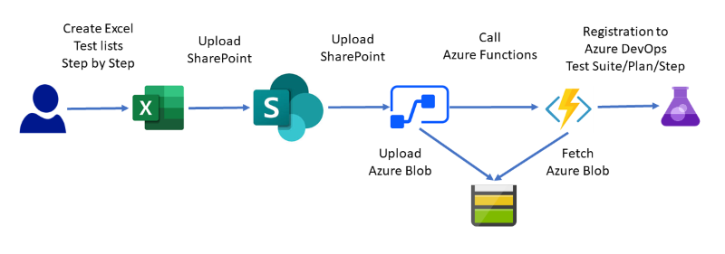
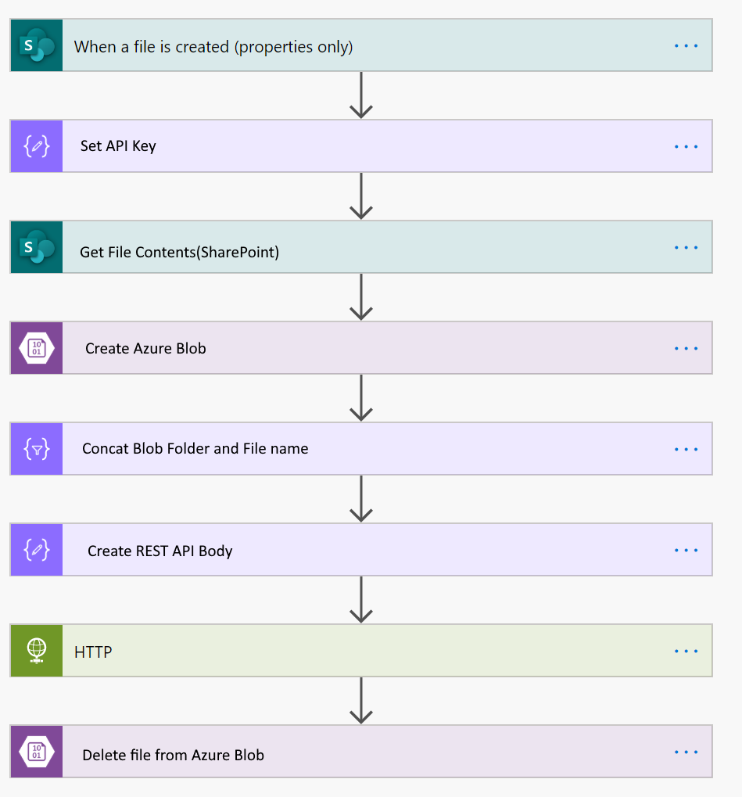
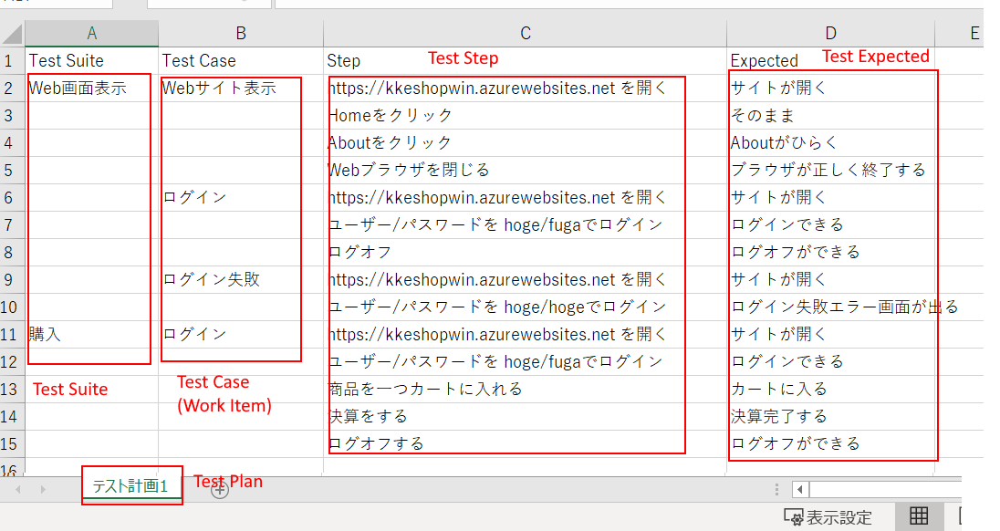

# Introduction of this tool(ツール紹介)

テスト管理をAzure DevOpsで実施するにはアレルギーのある方はどうしてもExcelで編集したい、という要望はよく聞きます。しかし、Azure DevOpsにはAzure TestPlansというテストを管理する機能が提供されており、そちらでテストケースを管理すれば、タスクの可視化やテスト成功率の集計も容易です。

そのようなミスマッチをうめるために、SharePointにアップロードしたExcelファイルをAzure Test Plansに登録するというサンプルを作ってみました。

**注意事項** : "Sync"という名前ですが、現状ExcelからAzure DevOpsへの一方通行です。

(English)  
If you're allergic to implementing test management in Azure DevOps, you're inevitably going to have to We often hear requests to edit in Excel. However, Azure DevOps includes Azure TestPlans, which manages tests feature, which allows you to manage test cases, visualize tasks and measure test success rates. Aggregation is also easy.

In order to avoid such mismatches, the Excel file to Azure Test Plans.

**Note** : "Sync" as it's called, but it's currently a one-way street from Excel to Azure DevOps 

## Development

### How to build

- open SyncTestCase.sln with Visual Studio 2019
- build

### Azure DevOps's PAT

This tool requires Azure DevOps's PAT(Personal Access Token). You must create PAT these scopes.

- Test Management(Read & write)
- Work Items(Read, write & manage)

### How to setup test envrionment

This tool using these environment variables. You must set OS's setting or Azure Function's.

- AZUREDEVOPS_PAT : Azure DevOps's PAT
- AZUREDEVOPS_ENDPOINT : Azure DevOps Organization's URL. ex: ```https://dev.azure.com/{org}/{Project}/_apis/```

```cmd
az functionapp config appsettings set --name MyFunctionApp --resource-group MyResourceGroup --settings "AZUREDEVOPS_PAT=$azuredevopspat"
az functionapp config appsettings set --name MyFunctionApp --resource-group MyResourceGroup --settings "AZUREDEVOPS_ENDPOINT=https://dev.azure.com/{org}/{Project}/_apis/"
```

### How to Test

- Start Debugger in Visual Studio 2019
- Call REST API

``` cmd
POST http://localhost:port/api/SyncTestCase
content-type:  application/json

{
    "path" : "https://{blobaccount}.blob.core.windows.net/testdata/",
    "filename": "testsheet.xlsx",
    "fullpath": "https://{blobaccount}.blob.core.windows.net/testdata/testdata.xlsx"
}
```

This sample works local debugging environment.

Use cUrl or [REST Client for VS Code](https://marketplace.visualstudio.com/items?itemName=humao.rest-client).

## Toolset

- .NET Core 3.1
- Azure Functions
- Azure Blob
- Power Automate or LogicApps
- SharePoint Online

### Data Flow



Azure BlobはAzureサブスクリプションが異なっている場合でもAzure ADの認証を使わずにデータを受け渡しするためです。したがって、Azure BlobのセキュリティにはSASトークンを使ったアクセスを行うことを推奨します。

(English)  
Azure Blob can be used for Azure AD's even if the Azure subscriptions are different This is to pass data without using authentication. Therefore, access to Azure Blob's security is done using SAS tokens We recommend that you do this.

### Power Automate



1. SharePointにExcelファイルを格納する
2. API Keyをエンコード
3. SharePointからファイル取得
4. Azure Blobを作成
5. Blobのフルパスを作成
6. REST API BODYを作成
7. Azure Functions呼び出し
8. Blob削除

**注意事項** : Azure Blobおよび、HTTPコネクターはプレミアムコネクターです

### Excel File format



- Excel sheet tab is "Test Plan"
- Excel column "A" is "Test Suite"
- Excel column "B" is "Test Step"
- Excel column "C" is "Test Step expected result"

## limitation (制限事項)

- [Azure Functionsにデプロイして、テスト実行すると、429 Client Errorが発生します](https://github.com/kkamegawa/SyncTestCase/issues/3)

## Future lists

- Area Path/Iteration support
- Without Azure Blob
- CI/CD(GitHub Action / Azure Pipeline)

## copyrights

(C) 2020 Kazushi Kamegawa All rights reserved.  
本コンテンツの著作権、および本コンテンツ中に出てくる商標権、団体名、ロゴ、製品、サービスなどはそれぞれ、各権利保有者に帰属します  

